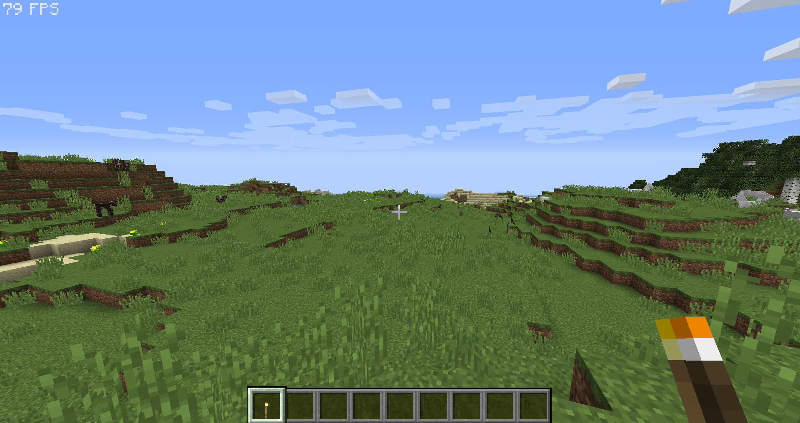
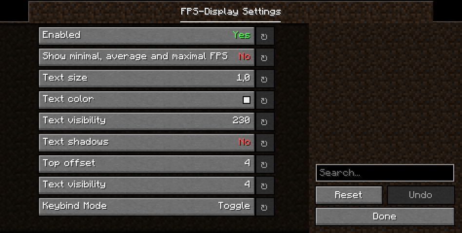

# FPS-Display

A simple **Fabric** mod that displays the current FPS on screen.

## 🖼️ Showcase

### ⚙️ Settings

In order to access the settings menu ingame, you either need [Cloth-Config](https://modrinth.com/mod/cloth-config) or [YetAnotherConfigLib](https://modrinth.com/mod/yacl) installed.
If both config libraries are installed YetAnotherConfigLib will be used.

Settings Menu (YetAnotherConfigLib)

Settings Menu (Cloth-Config)

## 📥 Downloads

You can download this mod from:
* [Modrinth](https://modrinth.com/mod/fpsdisplay)
* [CurseForge](https://www.curseforge.com/minecraft/mc-mods/fpsdisplay)

## 🎲 Version support

| Minecraft version | Latest mod version | Support status            |
| ----------------- | ------------------ | ------------------------- |
| 1.21.11           | `4.5.1`            | :heavy_check_mark: Active |
| 1.21.9, 1.21.10   | `4.4.4`            | :x: Obsolete              |
| 1.21.6 - 1.21.8   | `4.4.2`            | :x: Obsolete              |
| 1.21.5            | `4.3.1`            | :x: Obsolete              |
| 1.21.4            | `4.3.0`            | :x: Obsolete              |
| 1.21.2, 1.21.3    | `4.2.3`            | :x: Obsolete              |
| 1.21, 1.21.1      | `4.2.1`            | :x: Obsolete              |
| 1.20.5, 1.20.6    | `4.1.0`            | :x: Obsolete              |
| 1.20.3, 1.20.4    | `4.0.0`            | :x: Obsolete              |
| 1.14 - 1.20.2     | `3.1.0`            | :x: Obsolete              |
| 1.12.2            |                    | :white_circle: soon™      |
| 1.8.9             | `3.1.0`            | :warning: soon™           |

Starting with v4.0 this mod will only be developed for the latest Minecraft version and maybe some older legacy versions I still care about.
