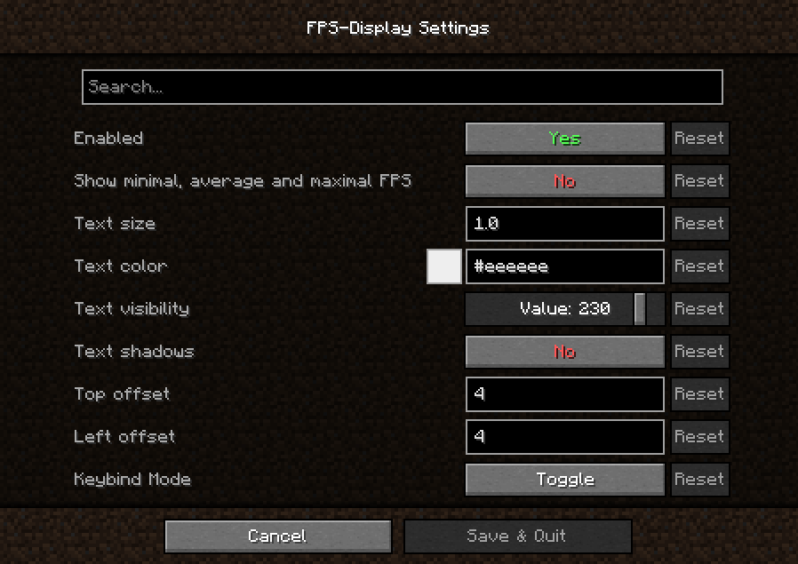

# FPS-Display
A simple **Fabric** mod that displays the current FPS on screen.

## 🖼️ Showcase:

    
Settings Menu

## 📥 Downloads:
You can download this mod from:
* [Modrinth](https://modrinth.com/mod/fpsdisplay)
* [CurseForge](https://www.curseforge.com/minecraft/mc-mods/fpsdisplay)

## 🎲 Supported versions:
Minecraft version: | Support:
------------------ | --------
1.20.x | ✔️ Active
1.19.4 | ✔️ Active
1.19.3 | ✔️ Active
1.18.2 | ✔️ Active
1.17.x | ✔️ Active
1.16.x | ✔️ Active
1.15.x | ✔️ Active
1.14.x | ✔️ Active
1.8.9 | ✔️ Active
